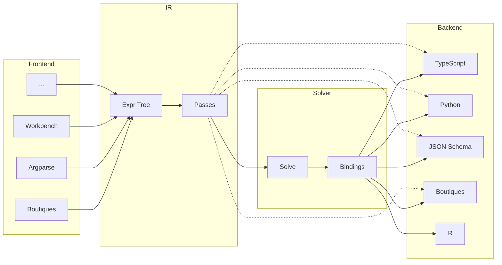

# Architecture

A compiler for CLI interface specifications. Parses CLI definitions from various sources, optimizes the intermediate representation, solves for minimal parameter bindings, and generates typed wrappers and schemas for multiple target languages.

## Pipeline

## Core Concepts

| Module        | Purpose                                                                                                                    |
| ------------- | -------------------------------------------------------------------------------------------------------------------------- |
| **ir**        | Canonical expression tree (Expr = Literal \| Sequence \| Alternative \| Optional \| Repeat \| Int \| Float \| Str \| Path) |
| **ir/passes** | Optimization passes: flatten, simplify, canonicalize, remove-empty                                                         |
| **bindings**  | Solved types (BoundType = scalar \| bool \| count \| literal \| optional \| list \| struct \| union)                       |
| **solver**    | IR → Bindings via pattern matching                                                                                         |
| **manifest**  | Optional metadata: Project > Package > App                                                                                 |
| **frontend**  | Parsers producing IR                                                                                                       |
| **backend**   | Code generators consuming IR + Bindings                                                                                    |

## Solver Patterns

| IR Pattern              | BoundType            |
| ----------------------- | -------------------- |
| `optional<literal>`     | `bool`               |
| `repeat<literal>`       | `count`              |
| `optional<T>`           | `optional<solve(T)>` |
| `repeat<T>`             | `list<solve(T)>`     |
| `sequence<...named...>` | `struct<...>`        |
| `alternative<...>`      | `union<...>`         |
| terminal                | `scalar`             |

## Design Philosophy

The key architectural improvement over Styx 1 is a clean separation of concerns for backends:

- **Solved bindings -> parametrization** - the solver (`solver/solver.ts`) walks the IR once and pattern-matches into a `BoundType` tree (bool, count, optional, list, struct, union, etc.). Backends translate these into the typed parameter interface that users interact with.
- **IR -> argument building logic** - the expr tree describes how to construct the command line (sequences, optionals, alternatives, literals). Backends translate the IR into runtime code that assembles CLI invocations, pulling values from the solved parameters to fill each slot.

The IR is the skeleton of the command line; the bindings define the typed interface; the argument builder walks the IR and pulls from the parametrization to assemble the final invocation. In Styx 1, these concerns were entangled - each backend had to re-derive types from the IR via a complex `LanguageProvider` protocol. In Styx 2, backends receive both pieces pre-computed and just translate them into target language constructs.

### Solver-owned facts

The solver attaches everything a backend needs to a binding during the same walk that produces it, so backends never re-derive structural facts from the IR. Each `Binding` carries three:

- **`type`** (`BoundType`) - the typed shape, for the parameter interface.
- **`gate`** (`GateAtom[]`) - the wrapper layers from the root (`present` / `variant` / `iter`), so "is this binding conditionally active, and under what?" is pure data. Backends nest guards/loops in array order.
- **`access`** (`AccessPath`) - where the binding's value lives relative to top-level `params`, as a segment list (`field(name)` | `iter(repeatBinding)`). A tiny per-language `renderAccess` turns it into `params.foo.bar` (TS) / `params["foo"]["bar"]` (Python); an `iter` segment resolves to the loop variable for that repeat. Assigned by a post-solve pass (`solver/assign-access.ts`) once all types have settled.

`access` exists because the answer to "where does binding X live" was previously re-derived independently by the cargs builder and the outputs emitter, which drifted. Computing it once in the solver collapses both into a pure lookup; any future consumer (validators, codecs, completion) inherits it for free. Notably the segment set needs only `field` and `iter` - complex-union variant fields are plain `field` segments off the union's path (the `@type` discriminant lives in `gate`, not the access path), and wrapper collapses like `optional<scalar>` are expressed by a binding inheriting its parent's path.

## Styx 1 vs Styx 2

|                     | Styx 1 (Python)                                                                          | Styx 2 (TypeScript)                                                                                                            |
| ------------------- | ---------------------------------------------------------------------------------------- | ------------------------------------------------------------------------------------------------------------------------------ |
| **IR**              | Dataclass hierarchy (`Param[T]` with body types)                                         | Algebraic expr tree with `kind` discriminant                                                                                   |
| **Optimization**    | Minimal (string merging)                                                                 | Pass-based pipeline (flatten, simplify, canonicalize)                                                                          |
| **Type resolution** | Direct mapping in frontend; each backend re-derives types via language provider protocol | Solver produces a universal `BoundType` tree; backends just translate it                                                       |
| **Backends**        | Python mature, TS/R partial; each implements a complex `LanguageProvider` protocol       | TypeScript, JSON Schema, Python, Boutiques complete; R deferred; backends just translate solved bindings                       |
| **Output files**    | First-class: path templates with param refs, suffix stripping, fallbacks                 | First-class via gate-on-binding: scope-by-IR-node bucketing, `ResolvedOutput` with path templates, suffix stripping, fallbacks |

Styx 2 is an evolved **successor** to Styx 1, not a drop-in replacement: the goal is to cover all of Styx 1's functionality while improving on its design, so breaking changes from Styx 1's output shape are expected and acceptable. Stream outputs (`stdout-output` / `stderr-output`) and mutable inputs (which surface as outputs via a writable copy) are implemented. Styx 1 functionality not yet implemented in Styx 2:

- **Boutiques constraint groups** - mutual exclusion, value-disables, value-requires - serialized round-trip deferred

## Roadmap

Long-term, Boutiques shifts from being the primary frontend to primarily a **backend** (for cross-compatibility and bootstrapping NiWrap onto the new compiler). Frontends:

- **Boutiques** - remains as both a frontend and a backend
- **Serialized Python argparse** (`argdump`) - implemented
- **Connectome Workbench** (`workbench`) - implemented; covers NiWrap's `wb_command` suite
- **argtype** (`argtype`) - implemented as both a frontend and a backend; the hand-authored, TypeScript-types-like DSL (see the [argtype spec](https://nx10.dev/argtype/)) intended as the primary way to define CLI specs. Covers the core grammar plus the `outputs`, `mediatypes`, and `paths` (`.mutable()` / `.resolveParent()`) extensions; `set` lowers to a sequence, `any` to its first branch, and the draft `constraints` extension is parsed-and-ignored. Frontend lives in `frontend/argtype/`, backend (IR -> argtype source, the round-trip/dogfooding path) in `backend/argtype/`. The emitter is dogfood-validated by round-tripping the whole niwrap corpus (every descriptor's emitted argtype must re-parse cleanly) plus property-based fuzzing over generated IR

### argtype syntax is upstream, in both directions

Styx neither parses nor prints argtype itself. Both ends go through [`@argtype/core`](https://github.com/nx10/argtype), the language's reference implementation, released independently of this compiler:

- **Frontend**: `parseArgtype` -> `inlineAliases` -> `resolveAnnotations` upstream, then `frontend/argtype/lower.ts` turns the resolved document into IR.
- **Backend**: `backend/argtype/emit.ts` builds an `AstDocument` from the IR and hands it to `printArgtype`.

So this repo holds no knowledge of argtype _syntax_ - no quoting, no escaping, no template metacharacters, no layout. It holds only the IR correspondence, which is the part it is actually qualified to decide.

The split follows what each side is allowed to decide. A parser must keep the document intact; a _generator_ may narrow it. Lowering is where the narrowing happens: `set` becomes a sequence and `any` becomes its first branch (lossless when emitting one invocation, lossy for anything that parses argv), and aliases are inlined by substitution. Those choices are correct here and wrong for a validator, a runner, or an editor - so they live in this repo, not upstream.

Extensions are opt-in **by import**, not by a config flag. `resolveAnnotations` interprets the spec core only; each extension vocabulary is a separate upstream pass (`resolveOutputs`, `resolveMediaTypes`, `resolvePaths`) returning results keyed by node, which `parser-frontend.ts` runs and passes to `lowerDocument` as `LoweringExtensions`. Styx deliberately does not run `resolveConstraints`: the IR cannot express inter-argument rules. An annotation no imported module claims is reported by `lower.ts` (`IMPLEMENTED_METHODS`) rather than dropped - a `.requires()` must never vanish from a generated wrapper without a signal.

**A diagnostic describes the document, not the subtree lowering keeps.** The two halves of that follow from one rule, and they pull in opposite directions if you take them one at a time:

- Upstream **target errors fire everywhere**, including on nodes lowering discards. `any("-f", x: str.mutable())` is an error even though only branch 0 reaches the IR, because `.mutable()` on a `str` is invalid argtype wherever it is written - the document is wrong, and it was only ever accepted because the old check ran per-lowered-node and never saw the branch. Suppressing it would make the same file valid or invalid depending on the order of its `any` branches.
- `lower.ts`'s **unclaimed-method scan walks the whole resolved document** (`reportUnconsumed`), not the nodes lowering visited, and distinguishes "Styx cannot represent this method" from "this node is not in the wrapper, so the method is ignored here". `IMPLEMENTED_METHODS` is a check on the method _name_, so it cannot see a method that is implemented but unread on this node - a `.default()` on an `any`, a `.join()` on an `opt` wrapping an alternative; those are reported at the point lowering decides not to read them.

An alias nobody references is the one case this repo cannot report: `inlineAliases` deletes the definition before lowering sees the document. `@argtype/core` warns (`unused-alias`) at the only point that still knows the alias existed.

**An output scope is a `sequence`, and how many children a wrapper happens to have is not part of that.** `opt`/`rep` with several children implicitly wrap them in a sequence, which owns their `.output()`s; a lone child used to be returned bare with the enclosing sink passed through, so its outputs escaped the wrapper that gates them and the generated wrapper promised them unconditionally. Adding one unrelated literal moved them back inside and flipped the generated type, which is what marked it a bug rather than a convention. `lower.ts`'s `wrapChildren` now adds the same sequence around a lone child whenever that child collected outputs. It has to be a `sequence` and not just `meta.outputs` parked on the child: only a sequence is force-bound as an output scope (`solver.ts`), and `simplify` keeps a single-literal sequence alive precisely when it carries outputs - so outputs on a bare literal are dropped rather than merely misplaced. Per-output gating is still recovered downstream from each ref binding's gate; that recovers gating only for templates that reference a binding inside the wrapper, which is why the scope has to be right too.

There is no typo detection upstream. After the extension split no layer knows the whole universe of method names, so a misspelled `.min()` and a method from an extension Styx does not implement are the same thing, and both surface as the same lowering warning. `CORE_METHODS` / `OUTPUT_METHODS` / … are exported if that ever needs reviving here.

One asymmetry worth knowing: `printArgtype` emits a `///` block line for line, because a printer has to reproduce the source it was given. `emit.ts` therefore word-wraps a description itself before handing it over - when generating from IR there is no original layout to preserve, so choosing one is the emitter's job.

Practical consequence: publish `@argtype/core` before merging a PR that raises the pin in `packages/core/package.json`, or `npm ci` fails on an unpublished version. The pin is **exact**, not a caret: CI installs with `npm ci`, so a range would leave the version consumers actually resolve untested here (styx's lockfile is not published, and the hub installs against its own).

What CI proves about an upstream bump is narrower than it looks, so it is worth being precise about. `corpus-roundtrip` asserts only that every descriptor compiles and re-parses with **zero errors** - it never compares the IR from the direct compile against the IR from the re-parse, so an upstream change that mis-splits a doc comment or drops a `.default()` round-trips clean. It is a good smoke test for a _syntax_ regression and near-blind to a semantic one. The gates that actually fire on a pin bump are `diagnostics.golden.test.ts` (exact text plus line:column for inputs now owned upstream), `semantic-roundtrip.test.ts` (generated TypeScript/Python compared across the round-trip), and `implemented-methods.test.ts` (fails when upstream grows a method this repo has not accounted for). Nothing in either repo automatically resolves a newer `@argtype/core`, so all of this only runs when a human raises the pin.

Running that canary locally has a trap: `scripts/corpus-roundtrip.mjs` imports `packages/core/dist`, not `src`, so a stale `dist` tests the previous _styx_ code and passes while the working tree is broken. Always `npm run build -w @styx-api/core -w @styx-api/cli` first. (`@argtype/core` itself is a declared dependency and stays external in the bundle, so a copy staged into `node_modules/@argtype/core` does take effect without a rebuild - it is styx's own `lower.ts`/`emit.ts` that go stale.)

## Ecosystem Context

This compiler is part of the **Styx/NiWrap ecosystem** ([niwrap.dev](https://niwrap.dev/)):

- **Styx compiler** (this repo) - generates type-safe bindings from CLI tool descriptions
- **NiWrap** - Boutiques descriptors for ~2,000 neuroimaging tools (FSL, FreeSurfer, ANTs, AFNI, MRTrix3, etc.) plus a build pipeline that feeds them through Styx to produce language-specific packages
- **NiWrap packages** - generated Python/TypeScript/R wrappers with IDE autocompletion and type checking
- **NiWrap Hub** - interactive web platform for exploring tools and generating code
